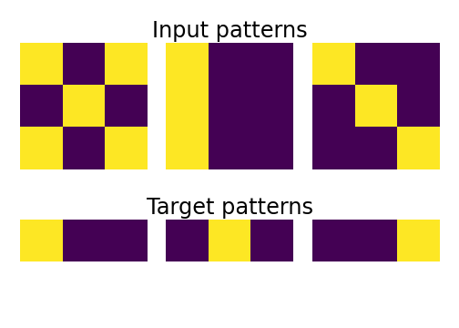
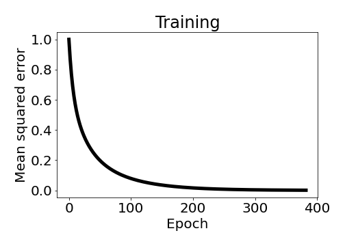
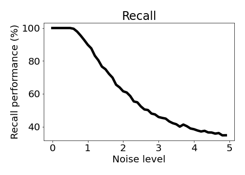

# Adaptive Linear Neuron - Adaline (1960)

## Adaline model for supervised machine learning

### Table of Contents

- [Images](#images)
- [Description](#description)
- [Keywords](#keywords)
- [How to Use](#how-to-use)
- [References](#references)
- [Author Info](#author-info)

## Images

## Description

"Adaline model for supervised machine learning."

#### Technologies

- Python programming language

## Keywords

 - Artificial neural network
 - Supervised model
 - Single-layer feedforward architecture
 - Binary input and target patterns
 - Stochastic gradient descent 
 - Activation function
 - Mean squared error
 - Learning rate
 - Weights

## How to Use

#### Getting started

`git clone https://github.com/berberianareg/Adaptive-linear-neuron.git`

#### Dependencies

see requirements.txt

#### Installation

`pip install numpy`

`pip install matplotlib`

#### Executing the program from command line

`python Adaline.py`

#### API Reference

## References

#### Links

- Wikipedia - (https://en.wikipedia.org/wiki/ADALINE)
- Relevant paper - (http://www-isl.stanford.edu/~widrow/papers/c1960adaptiveswitching.pdf)

## Author Info

- Twitter - [@berberianareg](https://twitter.com/BerberianNareg)
- LinkedIn - [Nareg Berberian](https://www.linkedin.com/in/nareg-berberian-phd-ab6759b9/)

[Back to the Top](#project-title)
